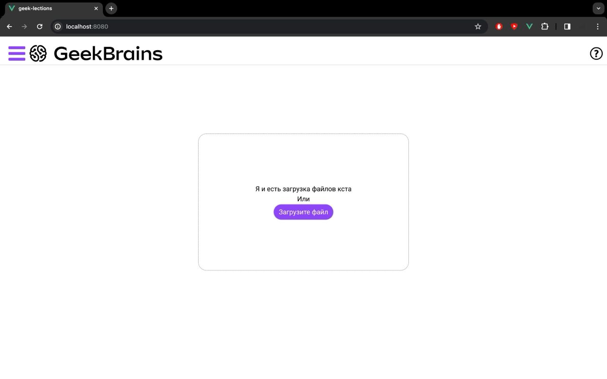
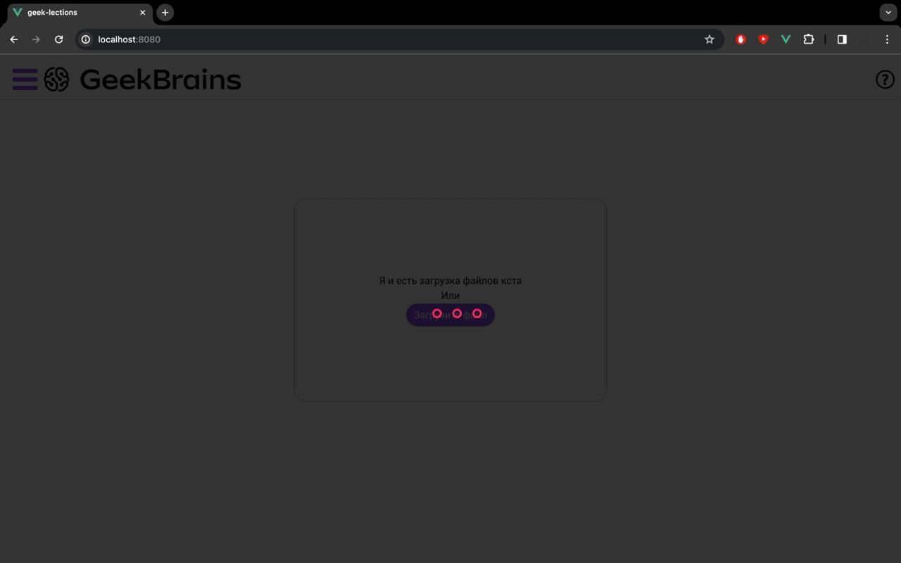
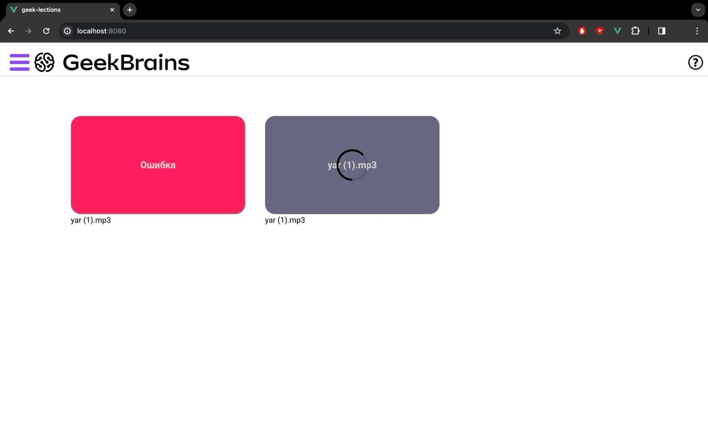
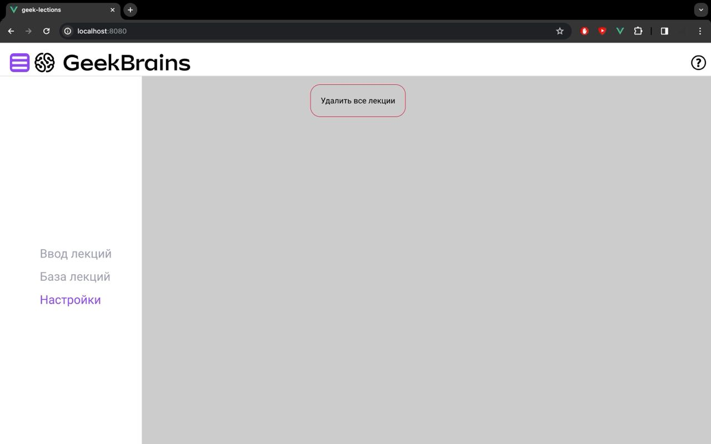

## Проект "Интеллектуальный ассистент методиста" от образовательной платформа Geekbrains
<!-- <a href="">Команда ИИнтеграция</a> -->

### Наша команда `ИИнтеграция`
<ul>
    <li><a href = "https://t.me/sherokiddo">Кирилл Брагин - Тимлид</a></li>
    <li><a href = "https://t.me/denisadminch">Денис Агапитов - Ml-engineer</a></li>
    <li><a href = "https://t.me/YarKo9_9">Ярослав Колташев - Ml-engineer</a></li>
    <li><a href = "https://t.me/gabbhack">Никита Габбасов - Back</a></li>
    <li><a href = "https://t.me/kai_Kane">Кирилл Резников - Front</a></li>
</ul>

## Описание кейса
В рамках международного хакатона "Цифрового прорыва" 2023 в Москве необходимо было решить кейс ["Интеллектуальный ассистент методиста"](https://hacks-ai.ru/hackathons.html?eventId=969092&caseEl=1059312&tab=1).

> В современном образовательном процессе качество подготовленных материалов — ключевой фактор успешного обучения. Методисты и преподаватели тратят значительное количество времени на анализ и совершенствование своих лекционных материалов.
> Нередко конспекты лекций могут быть написаны некачественно, что затрудняет процесс обучения студентов, а транскрибация и анализ аудио лекций — трудоемкий процесс, который существенно облегчился бы с применением ИИ.
> Командам предстоит разработать сервис, который сможет создавать на основе аудиозаписи лекций транскрибированный текст, выделяя в тексте сложные термины записывая их в глоссарий. Полученный конспект должен включать в себя глоссарий где описаны сложные темы в лекции.

## Подготовка

В рамках подготовки к решению данного кейса мы протестировали модели транскрибации и LLM для извлечения определений и терминов из текста.

Модели транскрибации которые мы попробовали

* whisper-large-v2
* wav2vec2-large-xlsr-53-russian

Модели LLM для извлечения определений и терминов

* [Saiga2_7b_lora](https://huggingface.co/IlyaGusev/saiga2_7b_lora)
* [Saiga_mistral_7b_lora](https://huggingface.co/IlyaGusev/saiga_mistral_7b_lora)

Самыми лучшими моделями оказались whisper-large-v2 и Saiga_mistral_7b_lora.
Также были протестированы квантованные модели семейства Saiga и путём экспериментов было выяснено, что модели не потеряли в точности и адекватности генерации текста, плюс они также оптимизированы под CPU.

## Хакатон

Основной задачей хакатона было реализовать глоссарий (термин - определение) с аудиозаписи лекции.  
Дополнительной задачей было реализовать конспект лекции по заданному шаблону. 

Также необходимо было реализовать web-сервис для загрузки и обработки аудиозаписей.

## Решение

В качестве решение было создано web-сервис, который позволяет загружать аудиозаписи лекции и обрабатывать аудиозаписи, выводя глоссарий с определениями и терминами и краткий конспект лекции.

`Под капотом` у веб сервиса находится модель траскрибации `whisper-large-v2` и LLM `Saiga_mistral_7b_lora_q4`.

`Веб сервис`

| |  |
| --- | --- |
|  |  |
|  |  |

В папке `ml` содержатся Jupiter Notebooks с разметкой конспекта лекции, запуск ML сервиса, обработка аудиозаписей и файл `sample_submission.csv`

### Тестовый файл аудиозаписи для проверки демки находится в папке `test_audio`
Так как наша демо находится на сервере, где доступен только процессор, большие файлы аудиозаписей будут обрабатываться очень долго.

### Структура
- `/app` - основная директория API ([FastAPI](https://fastapi.tiangolo.com/))
- `/app/background` - модули, связанные с фоновой обработкой аудио ([arq](https://arq-docs.helpmanual.io/))
- `/app/routes/v1/lectures.py` - роуты API
- `/app/queries.py` - [сгенерированные](https://www.edgedb.com/docs/clients/python/api/codegen) запросы к [EdgeDB](https://edgedb.com)
- `/dbschema/default.esdl` - схема БД
- `/dbschema/queries` - запросы к EdgeDB, которые [генерируются](https://www.edgedb.com/docs/clients/python/api/codegen) в `/app/queries.py`.
- `/dbschema/migrations` - миграции БД
- `/frontend` - фронтенд ([Vue](https://vuejs.org/))
- `/scripts` - bash скрипты для запуска API и воркера для очереди задач
- `captain-definition-*` - файлы с описанием как запускать каждый элемент веб-сервиса в [CapRover](https://caprover.com/)

## Деплой

### Docker

#### Запуск

1. Создайте `.env` файл из `.env.example`
2. Укажите желаемые имя пользователя и пароль для minio
3. Запустите minio командой `docker compose up -d minio` 
4. Откройте в браузере [localhost:9000](http://localhost:9000).
Введите логин и пароль из пункта 2.
Перейдите на вкладку `Access Keys`, создайте новый ключ доступа с помощью кнопки `Create access key`
5. Полученные `Access Key` и `Secret Key` укажите в
`S3_ACCESS_KEY` и `S3_SECRET_KEY` в файле `.env` соответственно.
6. Вернитесь в интерфейс minio во вкладку `Buckets`.
Создайте новый bucket с помощью кнопки `Create Bucket`. Укажите имя и создайте bucket.
7. Указанное имя пропишите в `S3_BUCKET` в файле `.env`
8. Запустите `edgedb` с помощью команды `docker compose up edgedb`. Первый запуск БД может занять время
9. Запустите все остальные контейнеры с помощью команды `docker compose up`
10. Перейдите в веб интерфейс по адресу [localhost:3000](http://localhost:3000)
